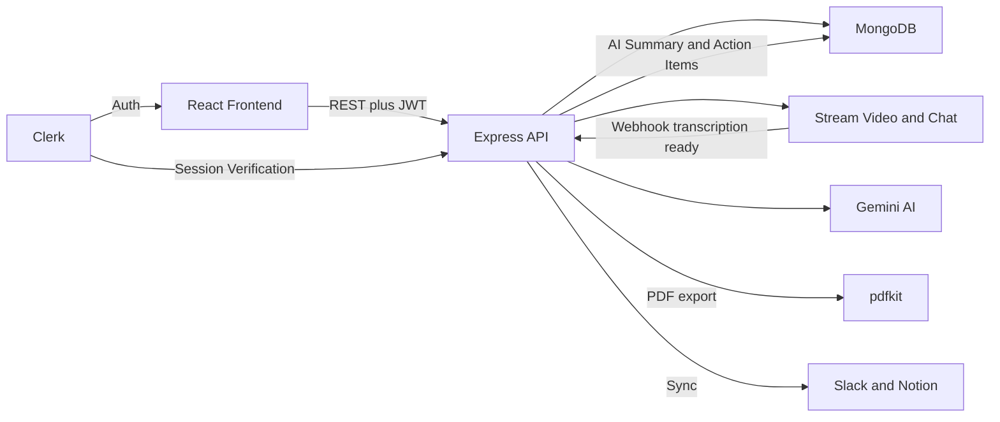

<div align="center">

# 🧠 IntellMeet

### AI-Powered Enterprise Meeting Intelligence Platform

**Transcribe. Summarize. Act. — Automatically.**

[](https://intell-meet-ruby.vercel.app)
[](https://intellmeet-backend-ba9b.onrender.com)
[](#-license)
[](#-development-roadmap)

[Live App](https://intell-meet-ruby.vercel.app) · [API](https://intellmeet-backend-ba9b.onrender.com) · [Report a Bug](shashankraj7604@gmail.com)

</div>

---

## 📌 Overview

**IntellMeet** is a full-stack, AI-powered video conferencing and meeting intelligence platform built for enterprise, startup, and company-level teams. It brings together live video calls, real-time transcription, and **Google Gemini**-driven summarization into a single workspace — so meetings turn into searchable notes and trackable tasks automatically, instead of disappearing the moment the call ends.

Built as a Zidio Development project, IntellMeet is designed and benchmarked against products like **Zoom, Google Meet, Linear, Loom, and Notion** for both functionality and interface quality.

---

## ✨ Features

### 🎥 Meetings & Video
- **Live video meetings** powered by the Stream Video SDK — instant meetings, scheduled meetings, and join-by-code
- **Adaptive meeting layout** with Google Meet–style responsive tiling for 1 to many participants, plus dedicated screen-share layouts
- **Waiting room & access control** — hosts can admit, deny, or admit-all, or open a meeting for anyone with the link
- **In-meeting chat** via Stream Chat, running alongside video
- **Live closed captions** with per-speaker attribution
- **Collapsible sidebar** for chat, transcript, and participant management
- **Post-call rating & insights gate** to capture quick feedback after every meeting

### 🤖 AI Meeting Intelligence
- **Real-time transcription**, automatically started and stopped with the call
- **Gemini-powered summaries** — structured executive summaries generated from the full transcript
- **Auto-extracted action items** with assignee and due-date detection, ready to promote into real tasks
- **Fallback processing pipeline** that recovers gracefully if a transcript arrives late or a webhook is missed

### 📋 Tasks & Teams
- **Kanban-style task board** with priority, due dates, assignees, and comments
- **One-click promotion** of AI-detected action items into tracked tasks
- **Multi-team workspaces** with admin/member roles, invites, and team switching
- **Analytics dashboard** — meeting cadence, ratings, engagement, and team productivity metrics

### 🗂️ Recordings, Transcripts & Sharing
- **Recordings library** with playback, per-session transcripts, and duration tracking
- **PDF export** of meeting notes and executive summaries (generated server-side)
- **Slack & Notion sync** — push summaries and action items straight into your team's existing tools

### 🔐 Platform
- **Secure authentication** end-to-end via Clerk (sign-up, sign-in, profile, sessions, password management)
- **Live dashboard** — upcoming meetings, recent AI summaries, and open action items at a glance

---

## 🏗️ Tech Stack

### Frontend
| Technology | Purpose |
|---|---|
| **React 19 + TypeScript** | Core UI framework |
| **Vite** | Build tooling & dev server |
| **Tailwind CSS v3 + shadcn/ui** | Styling & component primitives |
| **TanStack Query** | Server state & data fetching |
| **Zustand** | Client state management (teams, meetings, tasks) |
| **Clerk (React)** | Authentication & user/session management |
| **Stream Video & Chat React SDK** | Video calls, chat, captions, recordings |

### Backend
| Technology | Purpose |
|---|---|
| **Node.js + Express** | REST API server |
| **MongoDB + Mongoose** | Primary database |
| **Clerk (Express)** | Auth middleware & session verification |
| **Stream (Node SDK)** | Video call orchestration, chat, recordings, transcription |
| **Google Gemini** (`gemini-2.5-flash`) | AI summarization & action item extraction |
| **pdfkit** | Server-side PDF generation, streamed to the client |
| **Inngest** | Background event handling (user sync, lifecycle webhooks) |

### Infrastructure
| Service | Purpose |
|---|---|
| **Vercel** | Frontend hosting |
| **Render** | Backend hosting |
| **MongoDB Atlas** | Managed database |

---

## 🧩 Architecture



**Flow:** A user starts, schedules, or joins a meeting → Stream handles video, chat, live captions, and transcription → once the call ends, a webhook (with a fallback polling path) delivers the transcript to the backend → Gemini processes it into a structured summary and action items → results are persisted in MongoDB and surfaced on the dashboard, where action items can be promoted to the team's task board, exported as a PDF, or synced to Slack/Notion.

---

## 📂 Repository Structure

```
IntellMeet/
├── frontend/                 # React + TypeScript client
│   ├── src/
│   │   ├── pages/            # Dashboard, MeetingRoom, TaskBoard, AISummary,
│   │   │                     # RecordingDetail, Onboarding, Sign In/Up
│   │   ├── components/       # AdaptiveMeetingLayout, ParticipantListPanel, etc.
│   │   ├── layouts/          # DashboardLayout (sidebar shell), AuthLayout
│   │   ├── store/            # Zustand stores (teams, meetings, tasks)
│   │   └── lib/               # api.ts (backend adapter), utils.ts
│   └── ...
└── backend/                  # Node.js + Express API
    ├── src/
    │   ├── models/            # User, Team, Session, Task, ActionItem,
    │   │                       # Invite, MeetingInvite
    │   ├── controllers/       # session, team, task, ai, webhook, chat
    │   ├── routes/
    │   ├── middleware/        # Clerk auth
    │   ├── services/          # Gemini AI pipeline, Slack/Notion integrations
    │   ├── lib/                # db, stream, env, resolveParticipants, inngest
    │   └── scripts/           # backfills & diagnostics (recordings, transcripts,
    │                          # Stream user sync)
    └── ...
```

---

## 🚀 Getting Started (Local Setup)

### Prerequisites
- Node.js 18+
- MongoDB instance (local or Atlas)
- Clerk account (API keys)
- Stream account (API key + secret)
- Google Gemini API key
- (Optional) ngrok, for testing Stream webhooks locally

### 1. Clone the repo
```bash
git clone https://github.com/TechShashank7/IntellMeet.git
cd IntellMeet
```

### 2. Backend setup
```bash
cd backend
npm install
```
Create a `.env` file:
```env
PORT=5000
DB_URL=your_mongodb_connection_string
CLIENT_URL=http://localhost:5173
CLERK_PUBLISHABLE_KEY=your_clerk_publishable_key
CLERK_SECRET_KEY=your_clerk_secret_key
STREAM_API_KEY=your_stream_api_key
STREAM_API_SECRET=your_stream_api_secret
GEMENI_API_KEY=your_gemini_api_key
INGEST_EVENT_KEY=your_inngest_event_key
INGEST_SIGNING_KEY=your_inngest_signing_key
```
```bash
npm run dev
```

### 3. Frontend setup
```bash
cd ../frontend
npm install
```
Create a `.env` file:
```env
VITE_CLERK_PUBLISHABLE_KEY=your_clerk_publishable_key
VITE_STREAM_API_KEY=your_stream_api_key
VITE_API_BASE_URL=http://localhost:5000/api
```
```bash
npm run dev
```

The app will be available at `http://localhost:5173`, with the API running on `http://localhost:5000`.

### 4. (Optional) Webhooks locally
To receive Stream transcription/recording webhooks during local development, tunnel the backend with ngrok and point the Stream dashboard's webhook URL at the tunnel:
```bash
ngrok http 5000
```

---

## 🗺️ Development Roadmap

- [x] **Phase 0** — Backend boot & MongoDB connection
- [x] **Phase 1** — Clerk authentication, end-to-end across the frontend
- [x] **Phase 2** — Meetings, tasks, team onboarding, and a real API layer
- [x] **Phase 3** — Stream webhook receiver + Gemini summarization pipeline
- [x] **Phase 4** — Live meeting room: chat, closed captions, adaptive video layout, screen share, waiting room, post-call ratings, Kanban board
- [x] **Phase 5** — recordings list/detail, playback, PDF export, timestamped transcript segments
- [x] **Phase 6** — PDF download, Slack, and Notion integrations per team

---

## 👥 Team

| Name | Role |
|---|---|
| **Shashank Raj** | Frontend & Product Architecture |
| **Tanuj Gupta** | Backend Development & Infrastructure |
| **Dara Saiteja** | Frontend Development |
| **Gaurav Kumar** | Backend Development |

---

<div align="center">

**IntellMeet** — Every Meeting. Summarized. Actioned. Done.

</div>
