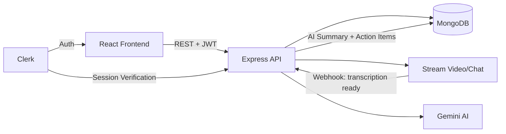

<div align="center">

# 🧠 IntellMeet

### AI-Powered Enterprise Meeting Intelligence Platform

Transcribe. Summarize. Act. — Automatically.

</div>

---

## 📌 Overview

**IntellMeet** is an AI-powered meeting intelligence platform built for enterprise, startup, and company-level teams. It captures live video meetings, transcribes conversations in real time, and uses **Google Gemini** to generate structured summaries and actionable follow-ups — automatically synced to a collaborative task board.

> ⚠️ **Status:** This project is under **active development**.

---

> ℹ️ The backend is hosted on Render's free tier, so the **first request may take up to ~50 seconds** to respond while the server spins up from sleep.

---

## ✨ Features

- 🎥 **Live Video Meetings** — Powered by Stream Video, with real-time call creation and management
- 📝 **Real-Time Transcription** — Every word captured and attributed automatically during calls
- 🤖 **AI Meeting Summaries** — Gemini distills full transcripts into structured, readable summaries
- ✅ **Auto-Extracted Action Items** — Decisions and next steps are pulled straight from the conversation
- 📋 **Task Board Sync** — Promote AI-detected action items into a real Kanban-style task board
- 💬 **In-Meeting Chat** — Stream Chat integration alongside video for parallel communication
- 👥 **Team Workspaces** — Multi-team support with role-based membership and invites
- 🔐 **Secure Auth** — Full authentication and user management via Clerk
- 📊 **Live Dashboard** — Upcoming meetings, recent summaries, and open action items at a glance

---

## 🏗️ Tech Stack

### Frontend
| Technology | Purpose |
|---|---|
| **React 19 + TypeScript** | Core UI framework |
| **Vite** | Build tooling & dev server |
| **Tailwind CSS v3** | Styling |
| **shadcn/ui** | Component primitives |
| **TanStack Query** | Server state & data fetching |
| **Zustand** | Client state management |
| **Clerk (React)** | Authentication |

### Backend
| Technology | Purpose |
|---|---|
| **Node.js + Express** | REST API server |
| **MongoDB + Mongoose** | Primary database |
| **Clerk (Express)** | Auth middleware & session verification |
| **Stream** | Video calls + real-time chat |
| **Google Gemini** | AI summarization & action item extraction |
| **Inngest** | Background event handling (user sync, webhooks) |

---

## 🧩 Architecture



**Flow:** A user starts or joins a meeting → Stream handles video/chat and live transcription → once a call ends, a webhook delivers the transcript to the backend → Gemini processes it into a summary + action items → results are stored in MongoDB and surfaced on the dashboard, where action items can be promoted to the shared task board.

---

## 📂 Repository Structure

```
IntellMeet/
├── frontend/               # React + TypeScript client
│   ├── src/
│   │   ├── pages/          # Dashboard, MeetingRoom, TaskBoard, AISummary, etc.
│   │   ├── layouts/        # DashboardLayout (sidebar shell)
│   │   ├── store/          # Zustand stores
│   │   └── lib/            # api.ts (backend adapter), utils.ts
│   └── ...
└── backend/                 # Node.js + Express API
    ├── src/
    │   ├── models/          # User, Team, Session, Task, ActionItem
    │   ├── controllers/     # session, team, task, ai, webhook, chat
    │   ├── routes/
    │   ├── middleware/      # Clerk auth
    │   ├── services/        # Gemini AI pipeline
    │   └── lib/             # db, stream, env, resolveParticipants
    └── ...

```

---

## 🚀 Getting Started (Local Setup)

### Prerequisites
- Node.js 18+
- MongoDB instance (local or Atlas)
- Clerk account (API keys)
- Stream account (API key + secret)
- Google Gemini API key

### 1. Clone the repo
```bash
git clone https://github.com/TechShashank7/IntellMeet.git
cd IntellMeet
```

### 2. Backend setup
```bash
cd backend
npm install
```
Create a `.env` file:
```env
PORT=5000
DB_URL=your_mongodb_connection_string
CLIENT_URL=http://localhost:5173
CLERK_PUBLISHABLE_KEY=your_clerk_publishable_key
CLERK_SECRET_KEY=your_clerk_secret_key
STREAM_API_KEY=your_stream_api_key
STREAM_API_SECRET=your_stream_api_secret
GEMENI_API_KEY=your_gemini_api_key
INGEST_EVENT_KEY=your_inngest_event_key
INGEST_SIGNING_KEY=your_inngest_signing_key
```
```bash
npm run dev
```

### 3. Frontend setup
```bash
cd ../frontend
npm install
```
Create a `.env` file:
```env
VITE_CLERK_PUBLISHABLE_KEY=your_clerk_publishable_key
VITE_API_BASE_URL=http://localhost:5000/api
```
```bash
npm run dev
```

The app will be available at `http://localhost:5173`.

---

## 🗺️ Development Roadmap

- [x] **Phase 0** — Backend boots cleanly against real MongoDB
- [x] **Phase 1** — Clerk authentication integrated, replacing mock auth store
- [x] **Phase 2** — Real meeting data pipeline (create, join, end sessions) wired into the dashboard
- [ ] **Phase 2.5** — Task status alignment between frontend/backend + full task board sync
- [ ] **Phase 3** — Gemini AI summary pipeline fully connected end-to-end
- [ ] **Phase 4** — Analytics, integrations (Slack/Notion), and polish

Development follows a **phased, browser-verified approach** — each phase is completed and tested before the next begins.

---

## 👥 Team

| Name | Role |
|---|---|
| **Shashank Raj** | Frontend & Product Architecture |
| **Tanuj Gupta** | Backend Development |

---

<div align="center">

**IntellMeet** — Every Meeting. Summarized. Actioned. Done.

</div>
